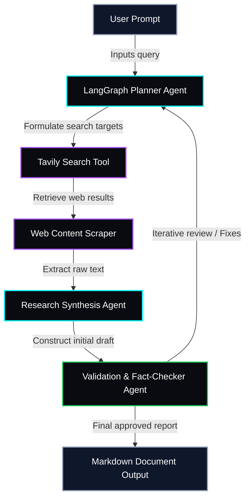

<!-- RAVIOS v4.0 OPERATING SYSTEM GRAPHICAL PORTAL -->

<!-- MAIN OPERATING PANEL - BENTO GRID INTERFACE -->
<table width="100%" border="0" cellpadding="10" cellspacing="5" style="border-collapse: collapse; border: none;">
<tr>
<td colspan="2" width="100%" style="background-color: #05060c; border: 1px solid #1e293b; border-radius: 8px; padding: 15px;">

[TERMINAL_SESSION_A // INITIATING SECURE SHELL]

<h3 style="margin-top: 0; color: #00F5FF; font-family: -apple-system, BlinkMacSystemFont, sans-serif;">◇ ABOUT_ME // WHOAMI</h3>
<pre style="font-family: 'Share Tech Mono', monospace; font-size: 13px; color: #cbd5e1; background: #030408; padding: 12px; border-radius: 4px; border-left: 3px solid #00F5FF; margin: 0; overflow-x: auto;">
$ whoami
<b>Ravi Anshu</b>
AI Engineer × Product Builder

Focus areas:
• Backend Engineering (FastAPI, Celery, Redis production pipelines)
• ML Inferences &amp; Explainability (CatBoost, XGBoost, SHAP attribution)
• Agentic AI Systems (LangChain, LangGraph custom tool interfaces)
• Model Context Protocol (MCP) server development
</pre>
</td>
</tr>
<tr>
<td width="50%" valign="top" style="background-color: #05060c; border: 1px solid #1e293b; border-radius: 8px; padding: 15px;">

[PORTFOLIO // ACTIVE_AI_AND_PIPELINES]

<h3 style="margin-top: 0; color: #00F5FF; font-family: -apple-system, BlinkMacSystemFont, sans-serif;">◇ ACTIVE CORE SYSTEMS</h3>

<b style="color: #ffffff;">🟢 <a href="https://github.com/Ravianshu19/AI-ML/tree/main/01-Agentic-Research-Workflow" style="color: #00F5FF; text-decoration: none;">Agentic Research Workflow</a></b> 
Autonomous AI multi-agent research workflow built with LangGraph. Coordinates planning, web scraping, and content synthesis to generate verified reports. 
Stack: Python, LangGraph, Tavily Search, Gemini API, Streamlit

<b style="color: #ffffff;">🟢 <a href="https://github.com/Ravianshu19/Financial-Market-Intelligence" style="color: #00F5FF; text-decoration: none;">Financial Market Intelligence</a></b> 
Real-time financial data pipeline and sentiment analysis aggregator. Ingests news streams, evaluates sentiments on tickers, and maps financial indicators. 
Stack: FastAPI, PostgreSQL, Redis, Celery, Transformer Models, Pandas

</td>
<td width="50%" valign="top" style="background-color: #05060c; border: 1px solid #1e293b; border-radius: 8px; padding: 15px;">

[PORTFOLIO // DATA_SCIENCE_AND_ANALYTICS]

<h3 style="margin-top: 0; color: #00F5FF; font-family: -apple-system, BlinkMacSystemFont, sans-serif;">◇ DATA SCIENCE &amp; ANALYTICS</h3>

<b style="color: #ffffff;">🟢 <a href="https://github.com/Ravianshu19/Data-Science/tree/main/Electric-Vehicles-Market-Analysis" style="color: #00F5FF; text-decoration: none;">Electric Vehicles Market Analysis</a></b>  
Large-scale geospatial data analysis and market intelligence dashboard. Maps EV adoption growth profiles, utility grid impacts, battery metrics, and registration patterns using public datasets.  
Stack: Jupyter Notebooks, Pandas, NumPy, Matplotlib, Seaborn, Scikit-Learn

</td>
</tr>
<tr>
<td colspan="2" width="100%" style="background-color: #05060c; border: 1px solid #1e293b; border-radius: 8px; padding: 15px;">

[ANALYTICS // DATAPACKS]

<h3 style="margin-top: 0; color: #00F5FF; font-family: -apple-system, BlinkMacSystemFont, sans-serif;">◇ GITHUB CORE TELEMETRY</h3>

</td>
</tr>
<tr>
<td width="50%" valign="top" style="background-color: #05060c; border: 1px solid #1e293b; border-radius: 8px; padding: 15px;">

[GRID_INTRUSION // ANIMATED]

<h3 style="margin-top: 0; color: #00F5FF; font-family: -apple-system, BlinkMacSystemFont, sans-serif;">◇ CONTRIBUTION SNAKE</h3>

</td>
<td width="50%" valign="top" style="background-color: #05060c; border: 1px solid #1e293b; border-radius: 8px; padding: 15px;">

[VERIFIABLE_MILESTONES // HISTORIC]

<h3 style="margin-top: 0; color: #00F5FF; font-family: -apple-system, BlinkMacSystemFont, sans-serif;">◇ VERIFIED CREDENTIALS</h3>

🏆 <b style="color: #ffffff;">Gridlock Hackathon 2.0 Win</b> 
Engineered the demand prediction model, scaling baseline R² performance from 90.9% to 98.77% via custom hyperparameter-tuned ensembles.

🥈 <b style="color: #ffffff;">Kaggle Classic: Titanic Ensemble</b> 
Achieved a Top 2% ranking on leaderboards utilizing custom feature extraction pipelines combined with XGBoost and random forests.

🥉 <b style="color: #ffffff;">Kaggle: Predict Future Sales</b> 
Placed in the Top 5% of leaderboards by developing robust rolling time-series features modeled through CatBoost regressions.

</td>
</tr>
<tr>
<td width="50%" valign="top" style="background-color: #05060c; border: 1px solid #1e293b; border-radius: 8px; padding: 15px;">

[AUDIO_STREAM // COGNITIVE_FUEL]

<h3 style="margin-top: 0; color: #00F5FF; font-family: -apple-system, BlinkMacSystemFont, sans-serif;">◇ NOW PLAYING</h3>

🎧 Coding + Coffee + Lo-Fi

</td>
<td width="50%" valign="top" style="background-color: #05060c; border: 1px solid #1e293b; border-radius: 8px; padding: 15px;">

[TECH_MATRIX // CAPABILITIES]

<h3 style="margin-top: 0; color: #00F5FF; font-family: -apple-system, BlinkMacSystemFont, sans-serif;">◇ TECH MATRIX</h3>

AI &amp; ML 

 
BACKEND &amp; DATA 

 
FRONTEND &amp; DEVTOOLS 

</td>
</tr>
</table>

<!-- COLLAPSIBLE SYSTEM SCHEMATICS (MERMAID) -->

<b>▼ VIEW AGENTIC RESEARCH WORKFLOW (SYSTEM SCHEMATIC)</b>

<!-- CONNECT SECTIONS -->
<h3 align="center" style="color: #00F5FF; font-family: -apple-system, BlinkMacSystemFont, sans-serif; letter-spacing: 2px;">◇ CONNECT // INITIATE_HANDSHAKE</h3>

 

<h4 style="font-family: 'Share Tech Mono', monospace; color: #a855f7; letter-spacing: 1px;">"Building intelligent systems, one commit at a time."</h4>

