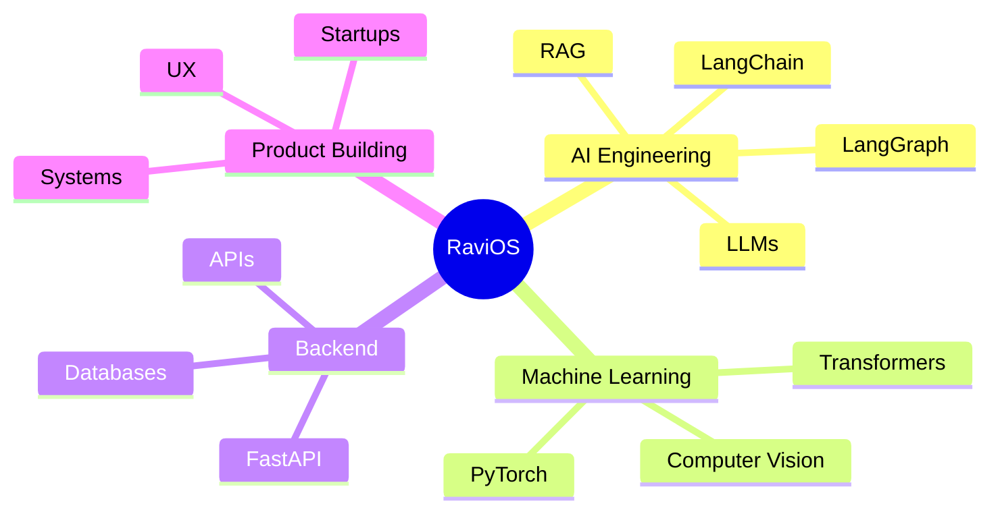

<!-- RAVIOS v4.0 OPERATING SYSTEM GRAPHICAL PORTAL -->

<!-- MAIN OPERATING PANEL - BENTO GRID INTERFACE -->
<table width="100%" border="0" cellpadding="10" cellspacing="5" style="border-collapse: collapse; border: none;">
<tr>
<td colspan="2" width="100%" style="background-color: #05060c; border: 1px solid #1e293b; border-radius: 8px; padding: 15px;">

[TERMINAL_SESSION_A // INITIATING SECURE SHELL]

<h3 style="margin-top: 0; color: #00F5FF; font-family: -apple-system, BlinkMacSystemFont, sans-serif;">◇ ABOUT_ME // WHOAMI</h3>
<pre style="font-family: 'Share Tech Mono', monospace; font-size: 13px; color: #cbd5e1; background: #030408; padding: 12px; border-radius: 4px; border-left: 3px solid #00F5FF; margin: 0; overflow-x: auto;">
$ whoami
<b>Ravi Anshu</b>
AI Engineer × Product Builder

Currently exploring:
• Generative AI &amp; Agentic Systems
• Advanced Retrieval-Augmented Generation (RAG)
• Distributed Systems Architecture &amp; Scalability
• Model Context Protocol (MCP) Servers &amp; Tools
</pre>
</td>
</tr>
<tr>
<td width="50%" valign="top" style="background-color: #05060c; border: 1px solid #1e293b; border-radius: 8px; padding: 15px;">

[MISSION_TELEMETRY // OBJECTIVES]

<h3 style="margin-top: 0; color: #00F5FF; font-family: -apple-system, BlinkMacSystemFont, sans-serif;">◇ CURRENT MISSION</h3>
<pre style="font-family: 'Share Tech Mono', monospace; font-size: 12px; color: #94a3b8; background: #030408; padding: 10px; border-radius: 4px; border-left: 3px solid #a855f7; margin: 0; white-space: pre-wrap;">
<b>Objective:</b>
Build autonomous AI products used by millions.

<b>Active Threads:</b>
- Teardown AI
- Financial Market Intelligence
- Open Source Agent Tools
- AI App Orchestrator

<b>System Status:</b> 🟢 STABLE
</pre>
</td>
<td width="50%" valign="top" style="background-color: #05060c; border: 1px solid #1e293b; border-radius: 8px; padding: 15px;">

[TECH_MATRIX // CAPABILITIES]

<h3 style="margin-top: 0; color: #00F5FF; font-family: -apple-system, BlinkMacSystemFont, sans-serif;">◇ TECH MATRIX</h3>

AI &amp; ML 

 
BACKEND &amp; DATA 

 
FRONTEND &amp; DEVTOOLS 

</td>
</tr>
<tr>
<td colspan="2" width="100%" style="background-color: #05060c; border: 1px solid #1e293b; border-radius: 8px; padding: 15px;">

[ANALYTICS // DATAPACKS]

<h3 style="margin-top: 0; color: #00F5FF; font-family: -apple-system, BlinkMacSystemFont, sans-serif;">◇ GITHUB CORE TELEMETRY</h3>

</td>
</tr>
<tr>
<td width="50%" valign="top" style="background-color: #05060c; border: 1px solid #1e293b; border-radius: 8px; padding: 15px;">

[ACTIVITY // HEATMAP]

<h3 style="margin-top: 0; color: #00F5FF; font-family: -apple-system, BlinkMacSystemFont, sans-serif;">◇ METRIC CHART</h3>

</td>
<td width="50%" valign="top" style="background-color: #05060c; border: 1px solid #1e293b; border-radius: 8px; padding: 15px;">

[GRID_INTRUSION // ANIMATED]

<h3 style="margin-top: 0; color: #00F5FF; font-family: -apple-system, BlinkMacSystemFont, sans-serif;">◇ CONTRIBUTION SNAKE</h3>

</td>
</tr>
<tr>
<td colspan="2" width="100%" style="background-color: #05060c; border: 1px solid #1e293b; border-radius: 8px; padding: 15px;">

[MILESTONES // ACHIEVEMENT_UNLOCKED]

<h3 style="margin-top: 0; color: #00F5FF; font-family: -apple-system, BlinkMacSystemFont, sans-serif;">◇ TROPHIES &amp; CAMPAIGN PROGRESS</h3>

<table width="100%" border="0" style="border: none; font-family: 'Share Tech Mono', monospace; text-align: center; color: #cbd5e1; font-size: 13px;">
<tr>
<td width="33%" style="padding: 10px; background-color: #030408; border-radius: 6px; border: 1px solid #1e293b;">

🏆 100+

Hackathons Joined

</td>
<td width="33%" style="padding: 10px; background-color: #030408; border-radius: 6px; border: 1px solid #1e293b;">

🥇 5

Hackathon Victories

</td>
<td width="33%" style="padding: 10px; background-color: #030408; border-radius: 6px; border: 1px solid #1e293b;">

🥈 35+

Kaggle Competitions

</td>
</tr>
</table>
</td>
</tr>
<tr>
<td width="50%" valign="top" style="background-color: #05060c; border: 1px solid #1e293b; border-radius: 8px; padding: 15px;">

[AUDIO_STREAM // COGNITIVE_FUEL]

<h3 style="margin-top: 0; color: #00F5FF; font-family: -apple-system, BlinkMacSystemFont, sans-serif;">◇ NOW PLAYING</h3>

🎧 Coding + Coffee + Lo-Fi

</td>
<td width="50%" valign="top" style="background-color: #05060c; border: 1px solid #1e293b; border-radius: 8px; padding: 15px;">

[SCHEMATICS // SYSTEMS_MAP]

<h3 style="margin-top: 0; color: #00F5FF; font-family: -apple-system, BlinkMacSystemFont, sans-serif;">◇ PROCESS_ARCHITECTURE</h3>
<pre style="font-family: 'Share Tech Mono', monospace; font-size: 11px; color: #94a3b8; background: #030408; padding: 10px; border-radius: 4px; border-left: 3px solid #00F5FF; margin: 0; white-space: pre;">
root: RaviOS
├── AI Engineering
│   ├── LangChain &amp; LangGraph
│   └── Multi-Agent Systems
├── Machine Learning
│   ├── PyTorch Core
│   └── Computer Vision
└── Backend Systems
    ├── FastAPI &amp; API Design
    └── Distributed Databases
</pre>
</td>
</tr>
</table>

<!-- COLLAPSIBLE DETAILED BLUEPRINT (MERMAID) -->

<b>▼ VIEW DEEP DIGITAL BLUEPRINT (MERMAID MAP)</b>

<!-- CONNECT SECTIONS -->
<h3 align="center" style="color: #00F5FF; font-family: -apple-system, BlinkMacSystemFont, sans-serif; letter-spacing: 2px;">◇ CONNECT // INITIATE_HANDSHAKE</h3>

 

<h4 style="font-family: 'Share Tech Mono', monospace; color: #a855f7; letter-spacing: 1px;">"Building intelligent systems, one commit at a time."</h4>

