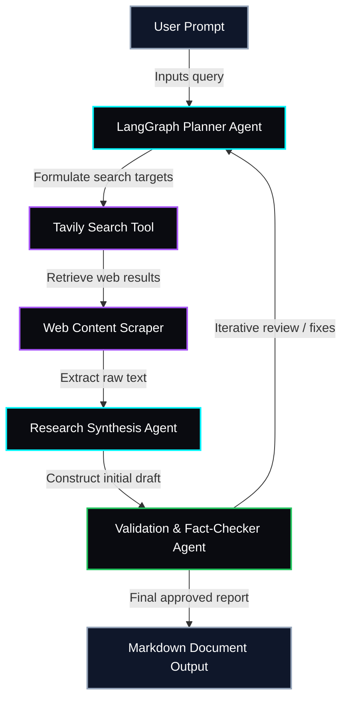

<!-- RAVIOS v4.0 — GITHUB PROFILE -->
<div align="center">


<br/><br/>

[](https://ravianshu19.github.io/Ravianshu19/)

<br/><br/>


</div>

---


---

## ◇ ABOUT\_ME // WHOAMI

```bash
> whoami
Ravi Anshu — AI Engineer × Product Builder

Focus areas:
• Backend Engineering      → FastAPI, Celery, Redis production pipelines
• ML Inference & XAI       → CatBoost, XGBoost, SHAP attribution
• Agentic AI Systems       → LangChain, LangGraph custom tool interfaces
• Protocol Engineering     → Model Context Protocol (MCP) servers
```

---


---

## ◇ ACTIVE\_CORE\_SYSTEMS

<table width="100%">
<tr>
<td width="50%" valign="top">

**🟢 [Agentic Research Workflow](https://github.com/Ravianshu19/AI-ML/tree/main/01-Agentic-Research-Workflow)**

Autonomous multi-agent research workflow built with LangGraph — coordinates planning, web scraping, and synthesis into verified reports.

`Python` `LangGraph` `Tavily` `Gemini API` `Streamlit`

</td>
<td width="50%" valign="top">

**🟢 [Financial Market Intelligence](https://github.com/Ravianshu19/Financial-Market-Intelligence)**

Real-time financial data pipeline and sentiment aggregator — ingests news streams and maps sentiment to tickers and indicators.

`FastAPI` `PostgreSQL` `Redis` `Celery` `Transformers`

</td>
</tr>
<tr>
<td width="50%" valign="top">

**🟢 [Electric Vehicles Market Analysis](https://github.com/Ravianshu19/Data-Science/tree/main/Electric-Vehicles-Market-Analysis)**

Large-scale geospatial analysis mapping EV adoption, grid impact, and battery metrics from public datasets.

`Jupyter` `Pandas` `NumPy` `Matplotlib` `Scikit-Learn`

</td>
<td width="50%" valign="top">

**🟠 More systems compiling...**

Additional modules in active development — check pinned repos for the latest builds.

[`→ View all repos`](https://github.com/Ravianshu19?tab=repositories)

</td>
</tr>
</table>

---


---

## ◇ GITHUB\_CORE\_TELEMETRY

<div align="center">


</div>

<br/>

<div align="center">


</div>

---


---

## ◇ CONTRIBUTION\_SNAKE

<div align="center">

<picture>
  <source media="(prefers-color-scheme: dark)" srcset="https://raw.githubusercontent.com/Ravianshu19/Ravianshu19/output/github-contribution-grid-snake-dark.svg" />
  <source media="(prefers-color-scheme: light)" srcset="https://raw.githubusercontent.com/Ravianshu19/Ravianshu19/output/github-contribution-grid-snake.svg" />
  
</picture>

</div>

---


---

## ◇ TECH\_MATRIX

<div align="center">

**AI & ML**


<br/><br/>

**BACKEND & DATA**


<br/><br/>

**FRONTEND & DEVTOOLS**


</div>

---


---

## ◇ SYSTEM\_SCHEMATIC

<details>
<summary><strong>▼ Agentic Research Workflow — Architecture</strong></summary>

<br/>



</details>

---


---

## ◇ NOW\_PLAYING

<div align="center">

[](https://open.spotify.com/playlist/37i9dQZF1DWWQRwui0ExPn)

🎧 *Coding + Coffee + Lo-Fi*

</div>

---


---

## ◇ CONNECT // INITIATE\_HANDSHAKE

<div align="center">

[](mailto:ravianshu278@gmail.com)
[](https://github.com/Ravianshu19)

<br/><br/>

**"Building intelligent systems, one commit at a time."**

<br/>


</div>
