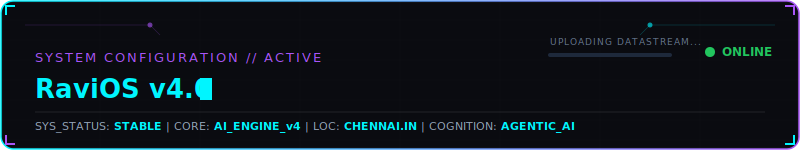
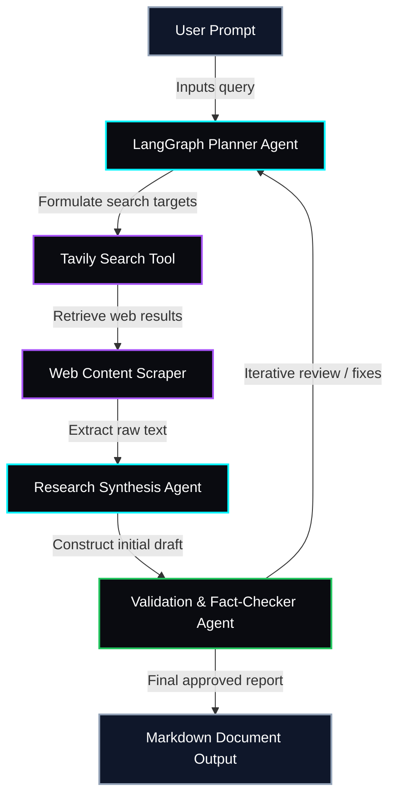

<!-- RAVIOS v4.0 — GITHUB PROFILE -->
<div align="center">



<br/>

[](https://ravianshu19.github.io/Ravianshu19/)

<br/>


</div>

<br/>


<br/>

## ◇ ABOUT_ME // WHOAMI

```bash
> whoami
Ravi Anshu — AI Engineer × Product Builder

Focus areas:
• Backend Engineering      → FastAPI, Celery, Redis production pipelines
• ML Inference & XAI       → CatBoost, XGBoost, SHAP attribution
• Agentic AI Systems       → LangChain, LangGraph custom tool interfaces
• Protocol Engineering     → Model Context Protocol (MCP) servers
```

<br/>


<br/>

## ◇ ACTIVE_CORE_SYSTEMS

<table width="100%">
<tr>
<td width="50%" valign="top">

**🟢 [Agentic Research Workflow](https://github.com/Ravianshu19/AI-ML/tree/main/01-Agentic-Research-Workflow)**

Autonomous multi-agent research workflow built with LangGraph — coordinates planning, web scraping, and synthesis into verified reports.

`Python` `LangGraph` `Tavily` `Gemini API` `Streamlit`

</td>
<td width="50%" valign="top">

**🟢 [Financial Market Intelligence](https://github.com/Ravianshu19/Financial-Market-Intelligence)**

Real-time financial data pipeline and sentiment aggregator — ingests news streams and maps sentiment to tickers and indicators.

`FastAPI` `PostgreSQL` `Redis` `Celery` `Transformers`

</td>
</tr>
<tr>
<td width="50%" valign="top">

**🟢 [Electric Vehicles Market Analysis](https://github.com/Ravianshu19/Data-Science/tree/main/Electric-Vehicles-Market-Analysis)**

Large-scale geospatial analysis mapping EV adoption, grid impact, and battery metrics from public datasets.

`Jupyter` `Pandas` `NumPy` `Matplotlib` `Scikit-Learn`

</td>
<td width="50%" valign="top">

**🟠 More systems compiling...**

Additional modules in active development — check the pinned repos below for the latest builds.

[`→ View all repos`](https://github.com/Ravianshu19?tab=repositories)

</td>
</tr>
</table>

<br/>


<br/>

## ◇ GITHUB_CORE_TELEMETRY

<div align="center">


</div>

<br/>

<div align="center">


</div>

<br/>

<div align="center">


</div>

<br/>


<br/>

## ◇ VERIFIED_CREDENTIALS

| | Achievement | Result |
|:---:|:---|:---|
| 🏆 | **Gridlock Hackathon 2.0 — Winner** | Demand-prediction model scaled from 90.9% → 98.77% R² via tuned ensembles |
| 🥈 | **Kaggle: Titanic Ensemble** | Top 2% leaderboard — custom feature pipeline + XGBoost + random forests |
| 🥉 | **Kaggle: Predict Future Sales** | Top 5% leaderboard — rolling time-series features + CatBoost regression |

<br/>


<br/>

## ◇ TECH_MATRIX

<div align="center">

**AI & ML**
<br/>


<br/><br/>

**BACKEND & DATA**
<br/>


<br/><br/>

**FRONTEND & DEVTOOLS**
<br/>


</div>

<br/>


<br/>

## ◇ NOW_PLAYING

<div align="center">

[](https://open.spotify.com/playlist/37i9dQZF1DWWQRwui0ExPn)

🎧 *Coding + Coffee + Lo-Fi*

</div>

<br/>


<br/>

<details>
<summary><strong>▼ SYSTEM_SCHEMATIC — Agentic Research Workflow</strong></summary>

<br/>



</details>

<br/>


<br/>

## ◇ CONNECT // INITIATE_HANDSHAKE

<div align="center">

[](mailto:ravianshu278@gmail.com)
[](https://github.com/Ravianshu19)

<br/><br/>

**"Building intelligent systems, one commit at a time."**


</div>
