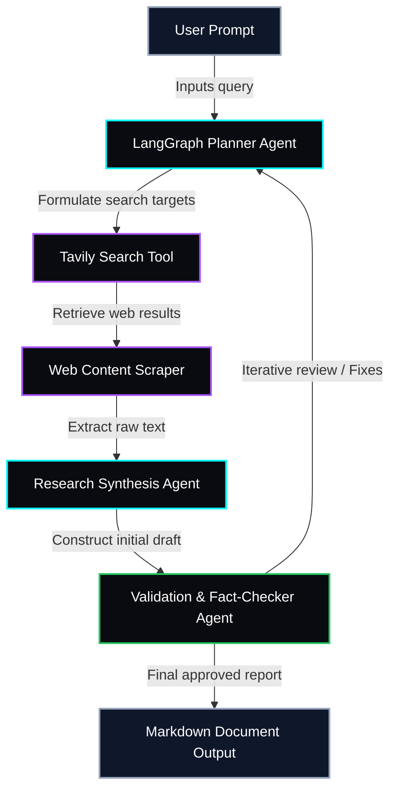

<!-- RAVIOS v4.0 OPERATING SYSTEM GRAPHICAL PORTAL -->
<div align="center">

</div>

<p align="center">
<a href="https://ravianshu19.github.io/Ravianshu19/">

</a>
</p>

<p align="center">


</p>

<div align="center">

</div>

<!-- ABOUT ME SECTION -->
<div align="left">
<h3>◇ ABOUT_ME // WHOAMI</h3>
</div>

```bash
> whoami

Ravi Anshu
AI Engineer × Product Builder

Focus areas:
• Backend Engineering (FastAPI, Celery, Redis production pipelines)
• ML Inferences & Explainability (CatBoost, XGBoost, SHAP attribution)
• Agentic AI Systems (LangChain, LangGraph custom tool interfaces)
• Model Context Protocol (MCP) server development
```

<!-- TWO COLUMN GRID: PROJECTS -->
<table width="100%">
<tr>
<td width="50%" valign="top">

### ◇ ACTIVE CORE SYSTEMS

* 🟢 **[Agentic Research Workflow](https://github.com/Ravianshu19/AI-ML/tree/main/01-Agentic-Research-Workflow)**  
  Autonomous AI multi-agent research workflow built with LangGraph. Coordinates planning, web scraping, and content synthesis to generate verified reports.  
  _Stack: Python, LangGraph, Tavily Search, Gemini API, Streamlit_

* 🟢 **[Financial Market Intelligence](https://github.com/Ravianshu19/Financial-Market-Intelligence)**  
  Real-time financial data pipeline and sentiment analysis aggregator. Ingests news streams, evaluates sentiments on tickers, and maps financial indicators.  
  _Stack: FastAPI, PostgreSQL, Redis, Celery, Transformer Models, Pandas_

</td>
<td width="50%" valign="top">

### ◇ DATA SCIENCE & ANALYTICS

* 🟢 **[Electric Vehicles Market Analysis](https://github.com/Ravianshu19/Data-Science/tree/main/Electric-Vehicles-Market-Analysis)**  
  Large-scale geospatial data analysis and market intelligence dashboard. Maps EV adoption growth profiles, utility grid impacts, battery metrics, and registration patterns using public datasets.  
  _Stack: Jupyter Notebooks, Pandas, NumPy, Matplotlib, Seaborn, Scikit-Learn_

</td>
</tr>
</table>

<div align="center">

</div>

<!-- TELEMETRY STATS -->
<div align="left">
<h3>◇ GITHUB CORE TELEMETRY</h3>
</div>

<div align="center">


</div>

<table width="100%">
<tr>
<td width="50%" valign="top">

### ◇ CONTRIBUTION SNAKE

<div align="center">


</div>

</td>
<td width="50%" valign="top">

### ◇ VERIFIED CREDENTIALS

* 🏆 **Gridlock Hackathon 2.0 Win**  
  Engineered the demand prediction model, scaling baseline R² performance from 90.9% to 98.77% via custom hyperparameter-tuned ensembles.
* 🥈 **Kaggle Classic: Titanic Ensemble**  
  Achieved a Top 2% ranking on leaderboards utilizing custom feature extraction pipelines combined with XGBoost and random forests.
* 🥉 **Kaggle: Predict Future Sales**  
  Placed in the Top 5% of leaderboards by developing robust rolling time-series features modeled through CatBoost regressions.

</td>
</tr>
</table>

<table width="100%">
<tr>
<td width="50%" valign="top">

### ◇ NOW PLAYING

<div align="center">
<a href="https://open.spotify.com/playlist/37i9dQZF1DWWQRwui0ExPn" target="_blank">

</a>
</div>

<p align="center">🎧 Coding + Coffee + Lo-Fi</p>

</td>
<td width="50%" valign="top">

### ◇ TECH MATRIX

<div align="center">
<strong>AI &amp; ML</strong><br/>

<br/><br/>
<strong>BACKEND &amp; DATA</strong><br/>

<br/><br/>
<strong>FRONTEND &amp; DEVTOOLS</strong><br/>

</div>

</td>
</tr>
</table>

<div align="center">

</div>

<!-- COLLAPSIBLE SYSTEM SCHEMATICS -->
<details>
<summary><strong>▼ VIEW AGENTIC RESEARCH WORKFLOW (SYSTEM SCHEMATIC)</strong></summary>
<br/>



</details>

<div align="center">

</div>

<!-- CONNECT SECTIONS -->
<h3 align="center">◇ CONNECT // INITIATE_HANDSHAKE</h3>
<div align="center">
<a href="mailto:ravianshu278@gmail.com">

</a>
<a href="https://github.com/Ravianshu19">

</a>
</div>

<br/>
<div align="center">
<h4>"Building intelligent systems, one commit at a time."</h4>

</div>
